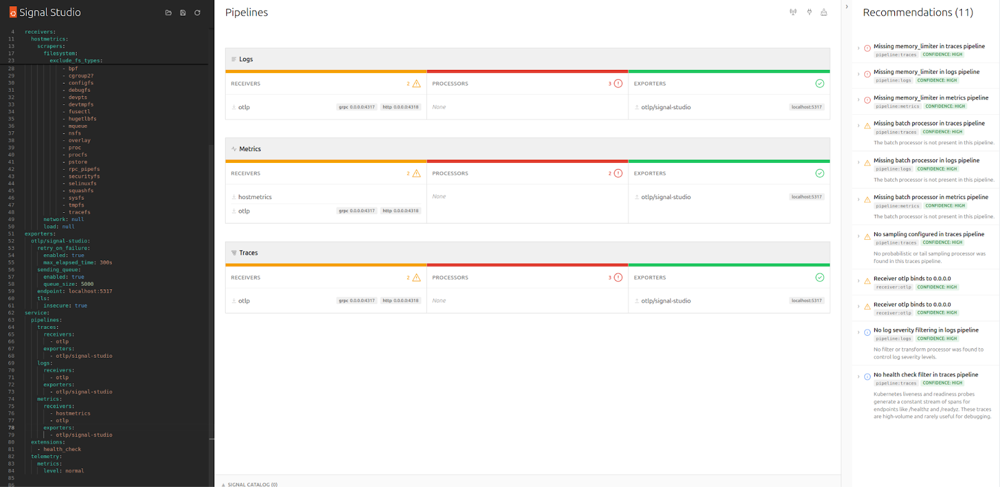
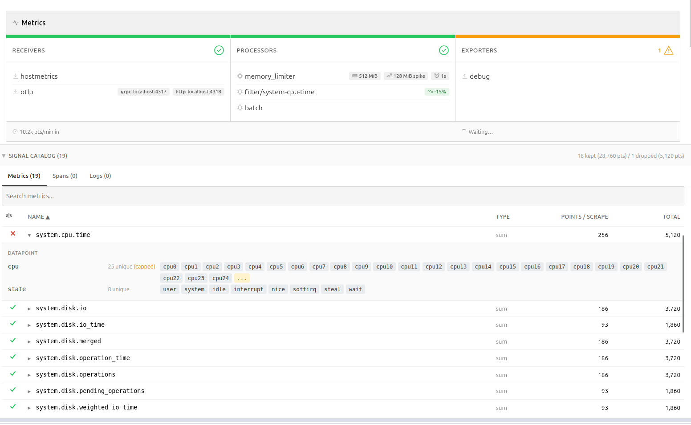
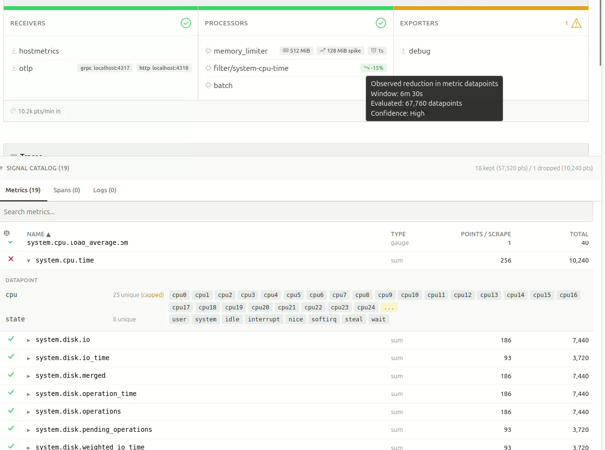
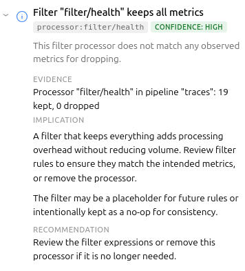

Teams continuously deploy programmable telemetry pipelines to production, without having access to a dry-run mode. At the same time, most organizations lack staging environments that resemble production – especially with regards to observability and other platform-level services. Despite knowing the potential risks involved due to the lack of a proper safety harness, most teams have no alternative, safe way to determine what telemetry they can actually cut to improve their signal-to-noise ratio without running the risk of missing something important.

So, teams resort to experimenting on live traffic.

What starts as a storage problem quickly becomes a cost problem due to the sheer volume of data stored. Not a "we should probably look into that," problem, but a "this line item is rivaling our compute spend," problem.

Programmable infrastructure usually ships with a way to preview change. Terraform has plan. Databases have EXPLAIN. Compilers have warnings. The OpenTelemetry Collector unfortunately has none of that. Software engineers edit YAML, reload the process, and cross their fingers they didn't just delete something they'll need during an incident. There are proprietary solutions available that help with noise reduction and cost analysis, but nothing in the open-source space.

This gap is what led me to build [Signal Studio](https://github.com/canonical/signal-studio).

Signal Studio adds a diagnostic layer to OpenTelemetry Collectors – something closer to a "dry-run" or "plan" mode for telemetry pipelines. It does this by combining static configuration analysis with live metrics and an ephemeral OpenTelemetry Protocol (OTLP) tap to evaluate filter behavior against observed traffic.

## The Problem with "Just Add More Filters"

If you've operated OpenTelemetry Collectors at any meaningful scale, you've probably had a conversation that goes something like this:

> "Our telemetry costs are too high."  
> "OK, let's add some filters."  
> "Which metrics do we drop?"  
> "…The ones we don't need?"

The issue isn't that teams don't want to reduce telemetry waste. It's that they lack visibility into what's actually flowing through the pipeline, which metrics are high-volume, which attributes are driving cardinality, and what a given filter expression would actually do. Sure – they can find it out by experimenting, but that's risky. If they get it wrong, they either risk dropping data they'll need during an incident, or not dropping enough data for it to meaningfully improve the signal-to-noise ratio.

## Three Tiers of Insight

Signal Studio works in three layers. Each layer adds more context and enables increasingly specific recommendations.

### Tier 1: Static Analysis

The first thing Signal Studio does is parse your Collector YAML and visualize the pipeline structure – receivers, processors, exporters – which it groups by signal type. In addition, it runs a set of static rules that catch common misconfiguration such as missing memory_limiters, undefined components, and unbounded receivers.

For each finding, the tool presents a severity, an explanation of why it matters, and a small YAML snippet suggesting a potential fix. At this point, no Collector connection is needed, nor is any alteration to your live configuration, making it very low risk compared to experimenting on live traffic.

### Tier 2: Live Metrics

While the tool's static analysis can tell you what you configured, it won't be able to answer what's actually happening in your pipeline. Connecting Signal Studio to your Collector's metrics endpoint adds a live dimension.

The pipeline diagram lights up with per-signal throughput rates, drop percentages, and exporter queue utilization. This enables additional rules to detect high drop rates, log volume dominance, queue saturation, and receiver-exporter rate mismatches. These are runtime concerns that YAML analysis won't be able to reveal.

While this does require a connection to be established to the Collector, it remains read-only, ensuring the blast-radius is kept to a minimum and that it won't be able to cause any harm to your live deployment. Signal Studio polls the metrics endpoint at a configurable interval and computes rates server-side. If the connection drops, the static linting and any findings discovered so far remain in place until a connection is available again.

### Tier 3: The OTLP Sampling Tap

This is where it gets interesting.

Signal Studio can spin up a lightweight OTLP receiver, supporting both gRPC and HTTP, allowing you to tap into your telemetry using a fan-out exporter in your Collector config. Once telemetry starts flowing, Signal Studio catalogs metric names, types, point counts, and – most importantly – attribute metadata. It is worth repeating at this point that nothing is persisted, the catalog is only stored in-memory.

#### Querying the Backend

"Why not just query the backend?" You may wonder. This is a legitimate question, and while that is certainly possible, the approach suffers from one critical flaw. The backend sees metrics from every source, not just this Collector.

As you can imagine, attribution in the backend becomes really tricky unless you enrich the data points with additional metadata. That approach is invasive and leaves attribution artifacts in your backend. It also pushes analysis away from the pipeline you actually need to change.

#### Memory Predictability

The attribute tracker is bounded by design: it stores up to 25 sample values per attribute key per metric, then switches to count-only mode. This keeps memory predictable, while still providing enough data for meaningful recommendations.

If a filter expression references an attribute value that wasn't observed within the bounded window, the result becomes "unknown", rather than extrapolated. The tool does not attempt to guess unseen values or predict long-tail behavior. This is a bounded simulation over observed traffic, not a probabilistic estimator.

## Filter Analysis for Your Pipeline

With metric names and attributes discovered, Signal Studio can do something that isn't possible with static analysis alone: predict what a filter processor would do, before you apply it.

It parses both legacy include/exclude syntax and modern OpenTelemetry Transformation Language (OTTL) expressions, like `name == "..."`, `IsMatch(name, "...")`, attribute equality, regex patterns, and `HasAttrKeyOnDatapoint`.

For each discovered metric, the tool predicts whether the filter would keep it or drop it – or whether it just can't tell, because the attribute was of too high cardinality, and the sample window didn't capture the relevant values.

The result shows up as a pill on the pipeline card: something like -34%, meaning "this filter would reduce datapoint volume by roughly 34%, based on what we've observed." Hover over it, and you immediately get the full picture – the observation window, total data points evaluated, and a confidence level based on sample size.

The confidence calculation is simple and deliberate: fewer than 5,000 observed data points are considered "Low", 5k-50k is "Medium", and above 50k is "High". No false precision. The thresholds are intentionally heuristic and visible; the goal is to communicate window size, not statistical certainty.

If filters are already applied upstream in the pipeline, those data points never reach the tap, and their impact cannot be evaluated.

## Recommendations That Know Your Data

The third rule tier – catalog rules – is where static analysis meets live discovery. These rules fire only when actual metric data is available, enabling findings like cardinality risks due to high attribute counts, certain metrics dominating the data, or Collector-internal telemetry being kept.

These rules shift the conversation from "you should probably add a filter", to "metric X has a high-cardinality http.route attribute and is a strong candidate for attribute reduction." In several production deployments I tested, single metrics accounted for ~60% of total telemetry volume through the Collector. That's difficult to reason about by reading YAML alone.

## Precise Recommendations

Recommendations are only useful if the reader can understand and assess them quickly. They need to be succinct, precise, and consistent.

Signal Studio uses a simple model: evidence → implication → recommendation, wrapped in a confidence indicator and scope tag.

The goal is to make it easy to decide whether to act or defer.

## Overarching Goals

Working on the first iteration of Signal Studio, I made a few choices that shaped the tool:

### Deliberately Read-only

Signal Studio never writes to your Collector. The OTLP tap is opt-in, and requires you to modify your own config. This was a deliberate decision – the tool should be safe to point at production, without anyone losing sleep.

Similarly, there's no "apply" button, no GitOps integration, no deployment pipeline. The user stays in control. This might seem like a missing feature, but it's a deliberate scope boundary – the tool diagnoses, the human decides. While every actionable finding includes a YAML snippet you can copy directly into your Collector config, you are the one who decides if, and when, that ever makes it into your pipelines.

### Single Binary, No Persistence

Everything lives in memory. No database, no state files. This makes deployment trivial, and keeps the blast radius small. At this point, I don't want to have to bother with the security aspects of running a shadow telemetry data store with all the PII implications and associated complexity that comes with it – and, almost certainly, neither do you.

### Honest About Uncertainty

As an example: when the attribute tracker caps out at 25 sample values, the filter analysis returns "unknown," instead of guessing. The projection pills show confidence levels. Findings include caveats when the recommendation depends on context (like container networking making 0.0.0.0 binding necessary).

Overpromising erodes trust faster than under-delivering, and when it comes to observability, you often only get one shot at making promises – rightfully so.

## What's Next?

The tool already does what I initially envisioned, and will only gain new features if they are considered useful enough. There are open questions around alert validation, PII detection, and cardinality estimation. I'll explore those separately. Programmable infrastructure without a diagnostics layer feels incomplete, and while I believe the outcome of this experiment has been surprisingly positive,

I'm curious how others are validating the impact of filter changes before deploying them to production OpenTelemetry Collectors?

You can reach us in [the project repository](https://github.com/canonical/signal-studio), or on [the Ubuntu Community Matrix](https://ubuntu.com/community/docs/communications/matrix).
